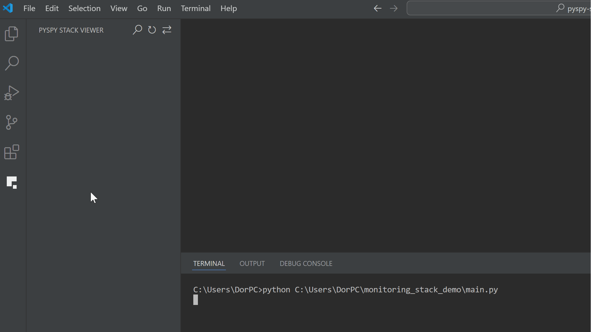

# PySpy Stack Viewer – “Where’s my Python process right now?”

A simple VS Code extension to instantly locate your Python process and see a live stack trace inside the editor.

  
   
  <i>▶ Demo: One-click stack trace viewer in VS Code</i>

---

> **TL;DR**  
> ✅ **Find** any long-running Python process  
> ✅ **Click once** – instantly view the live stack trace inside VS Code  
> ✅ **Click a frame** – jump to the exact code line  
> ✅ **No terminal needed** – no PID hunting, no extra windows

---

## Why you might need it 🤕

* **The Pain**  
  You launched a script / worker / web-server that has now been
  “running forever”.  
  The log is quiet, CPU is low, you *think* it’s not hung …  
  but you have **no idea** where it is inside the code.

* **Existing Tool**  
  `py-spy dump --pid 12345` *can* show the stack-trace, but:  
  - You have to look up the PID yourself  
  - The output is in the terminal – not linked to files  
  - Every refresh → new command / new window

## What this extension gives you 🚀

All the features shown in the demo above:

- One-click attach to any Python process
- Sticky header with process name, PID, and command line
- Tree view of the live Python stack
- Click a frame to jump to the source
- Manual refresh & frame order toggle

## Quick start 🛠️

### 1. Install

- 📦 From the Marketplace: search for **“PySpy Stack Viewer”**  
  *(extension ID: `pyspy-stack-viewer`)*  
- Or install manually via `.vsix`:  
  *Extensions ▸ ⋯ ▸ Install from VSIX*

### 2. Using the extension

- Click the **side icon**  to open the panel.

- Three toolbar buttons appear:

  | Button | Action         | Description |
  |--------|----------------|-------------|
  | 🔍     | **Attach**     | Pick a running Python process. The list shows **PID + command**, with full command line on hover. |
  | ↻     | **Refresh**    | See the current stack trace of the process. The top frame is where your code is *right now*. |
  | ⇄     | **Toggle order** | Switch between bottom-to-top and top-to-bottom stack display. |

- **When the process ends**:  
  The tree view doesn’t disappear immediately (to avoid disrupting your inspection).  
  Press ↻ to refresh – you’ll then see a “Process ended” message and the tree will clear.

## Under the hood 🔧

* On first use the extension **installs `py-spy 0.4.0`** into VS Code’s
  private storage – you don’t need to pre-install anything.
* Requires **Python 3 on your PATH** (or configured interpreter in
  *Python for VS Code*).  
  The same interpreter is used to `pip install py-spy`.
* Needs permission to *ptrace* the target process. On Linux that means:
  * Same user – works out of the box when both VS Code and the process run
    under you.  
  * Different users / sudo – run VS Code with the same privileges or lower
    `ptrace_scope`.

## Limitations & tips 📎

* Each refresh is a **snapshot** – there’s no auto-polling (by design, zero overhead).  
  If you want a new view ➜ press ↻.
* Pure-C / native threads won’t show Python frames (that’s a CPython limit).
* If the list shows *no* Python processes, make sure your remote / WSL
  session sees them (they must be on the **same machine**).

## Contributing / Issues 🤝

Found a bug? Need another feature? PRs are welcome.  
Please include:

* VS Code version  
* OS (and remote/WSL if relevant)  
* Exact error message from **View ▸ Output ▸ “PySpy Stack Log”**

## License 📄

MIT – do whatever you like, but don’t blame us if your processes freeze 😉
